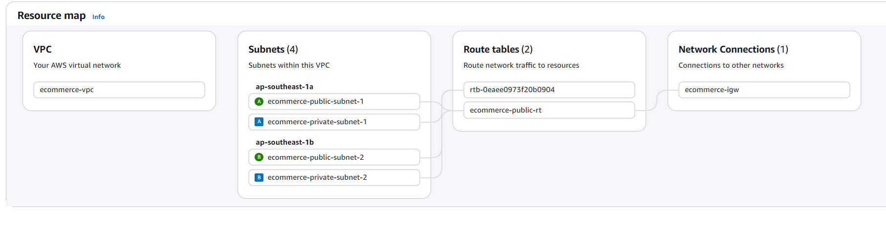
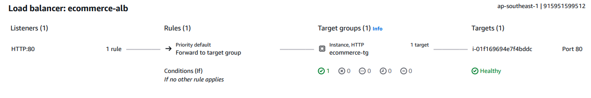

# 🏗️ AWS Cloud Infrastructure Lab

A production-grade AWS cloud infrastructure with VPC networking,
compute auto scaling, managed database, and monitoring.

## 🏛️ Architecture

### ALB & Auto Scaling Setup

## ☁️ AWS Services Used

| Service | Purpose |
|---|---|
| VPC | Custom network (10.0.0.0/16) |
| Subnets | 2 public + 2 private across 2 AZs |
| Internet Gateway | Public internet access |
| Route Table | Traffic routing rules |
| Security Groups | Firewall for ALB, EC2, RDS |
| EC2 + Auto Scaling | 2 instances, scales 1-4 |
| ALB | Load balancer distributing traffic |
| RDS MySQL | Database in private subnet |
| S3 | Object storage for backups |
| CloudWatch + SNS | Monitoring and email alerts |

## 🌐 Live Demo 

http://ecommerce-alb-101736816.ap-southeast-1.elb.amazonaws.com

## 📊 Monitoring

- CloudWatch alarm: CPU > 70% → SNS email alert
- CloudWatch alarm: Unhealthy host → SNS email alert

## 🎯 Key Concepts Practiced

- Network isolation (public vs private subnets)
- High availability across multiple AZs
- Auto scaling based on CPU utilization
- Security best practices (least privilege)
- Infrastructure monitoring and alerting
